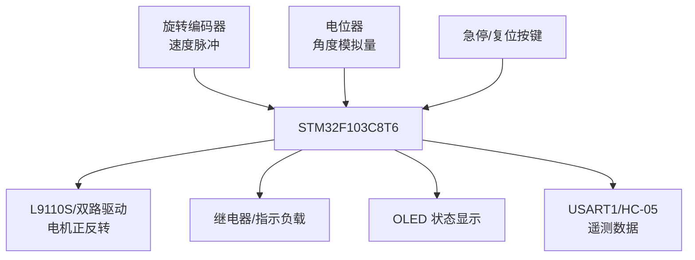
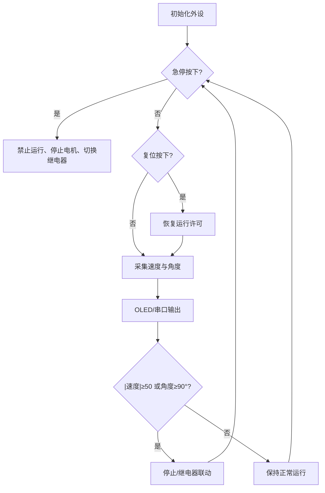

# STM32 随车吊远程监测与安全控制实验系统

> 基于 STM32F103C8T6 的随车吊缩比实验平台，集成编码器测速、电位器角度采集、电机正反转、继电器联动、OLED 显示、串口数据上传以及急停/复位保护。

## 项目简介

本项目面向随车吊旋转机构的状态监测与安全控制验证。STM32 周期采集编码器速度和电位器角度，在 OLED 上显示状态，并通过 USART1 发送遥测数据。当速度或角度超过程序阈值时，系统停止电机并切换继电器状态；急停按键可立即进入停机状态，复位按键用于恢复运行许可。

## 系统架构



## 功能特性

- TIM3 编码器模式采集速度脉冲
- TIM2 周期中断计算速度
- ADC1 采集电位器并映射旋转角度
- 两路 GPIO 控制电机正反转/停止
- 继电器进行阈值联动
- 急停与复位独立输入
- OLED 显示速度和角度
- USART1 每 200 ms 输出遥测字符串

## 硬件组成

| 模块 | 作用 |
|---|---|
| STM32F103C8T6 | 主控制器 |
| 旋转编码器 | 速度/方向脉冲 |
| 电位器角度传感器 | 模拟角度采集 |
| L9110S 或兼容 H 桥 | 电机正反转 |
| 继电器模块 | 联动控制/指示 |
| HC-05 或 USB-TTL | 串口遥测 |
| OLED | 本地显示 |
| 急停、复位按键 | 安全控制 |

## 关键接线

以下引脚来自当前源码：

| STM32 引脚 | 信号 |
|---|---|
| PA0 / ADC1_CH0 | 电位器模拟输出 |
| PA3 | 电机方向 A |
| PA4 | 电机方向 B |
| PA5 | 继电器控制 |
| PB0 | 急停按键，低电平有效 |
| PB1 | 复位按键，低电平有效 |
| PA9 / USART1_TX | HC-05 RX 或 USB-TTL RX |
| PA10 / USART1_RX | HC-05 TX 或 USB-TTL TX |

编码器、OLED 的具体引脚以 `STM32/Hardware/Encoder.c` 和 `OLED.c` 为准。完整接线与代码说明见 [项目技术指南](docs/PROJECT_GUIDE.md)。

> 电机必须通过驱动模块供电，继电器线圈应使用模块或驱动级，不能直接由 STM32 GPIO 驱动。控制系统只用于实验验证，不可直接替代工程机械安全控制器。

## 遥测协议

USART1 输出 ASCII 行：

```text
Speed:123 Angle:45.6\r\n
```

当前发送周期约 200 ms。该链路可以接 HC-05、USB-TTL 或其他 3.3 V TTL 串口设备。

## 控制逻辑



## 快速开始

1. 使用 Keil MDK 打开 `STM32/Project.uvprojx`；
2. 安装 STM32F1 Device Pack；
3. 根据接线表连接传感器、驱动、OLED 和按键；
4. 首次调试时断开机械负载或架空运动机构；
5. 编译并烧录；
6. 用串口工具设置工程实际配置的波特率，观察遥测；
7. 分别测试急停、复位、速度阈值和角度阈值。

## 仓库结构

```text
├── STM32/
│   ├── User/main.c          # 主控制与安全逻辑
│   ├── Hardware/Encoder.c   # 编码器
│   ├── Hardware/adc.c       # 角度采集
│   ├── Hardware/usart.c     # 遥测通信
│   ├── Hardware/Key.c       # 急停/复位
│   ├── System/Timer.c       # 定时器
│   └── Project.uvprojx      # Keil 工程
├── 技术讲解文档.docx
├── 使用说明.pdf
└── docs/PROJECT_GUIDE.md
```

## 当前实现边界

- `Motor_SetSpeed()` 只根据参数正负控制方向，没有硬件 PWM 调速；
- 主循环将编码器测得的 `Speed` 直接作为电机方向输入，属于实验性逻辑，并非速度闭环；
- 角度阈值为 90°，速度阈值为 ±50，需结合机构标定；
- 继电器控制宏的电平含义取决于模块是高电平还是低电平触发；
- 未实现通信校验、命令下发协议和故障锁存。

## License

仓库当前未声明开源许可证。未经作者明确授权，默认保留全部权利。
